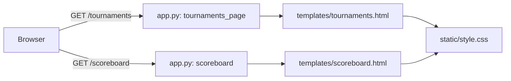

# Batch Briefing — batch-canonical-t01
_Generated: 2026-04-20_

---

## Architecture Overview

This is a single-page Flask app with server-rendered Jinja2 templates and a static CSS file. No build step, no component framework.



The nav bar on each interior page is a static `<p class="subtitle">` containing inline `<a class="nav-link">` anchors. There is no shared nav partial — each template duplicates this pattern.

---

## Key Files

| File | Purpose |
|------|---------|
| `templates/tournaments.html` | Tournaments page — contains the subtitle nav with the Scoreboard link |
| `templates/scoreboard.html` | Scoreboard page — contains the subtitle nav (currently only Back to Game) |
| `static/style.css` | Global stylesheet — defines `.nav-link` styles |
| `app.py` | Flask routes — no changes needed for this task |

---

## Conventions

- Nav links use class `nav-link`: `color: #4ade80; text-decoration: none; font-size: 0.8rem; letter-spacing: 2px; text-transform: uppercase;`
- Hover state defined separately: `a.nav-link:hover { color: #86efac; }`
- The CSS lives inline in a `<style>` block inside each template (not in `style.css` globally). **Both templates define their own `.nav-link` rule locally.**
- Active states are not currently used anywhere in the codebase — this will be a new pattern.
- Accent green: `#4ade80` (primary), `#86efac` (lighter/hover), `#22c55e` (darker).

---

## Gotchas

- `style.css` does **not** contain `.nav-link` — it is defined per-template in inline `<style>` blocks. Adding `.nav-link--active` to `style.css` won't work unless the templates reference that class. The safest approach is to add the `.nav-link--active` rule to the inline `<style>` block in each affected template.
- `scoreboard.html` currently only has one nav link ("← Back to Game"). The task scope suggests adding a Tournaments link and marking it inactive, OR simply adding an active self-reference if appropriate — but the primary requirement is the `/tournaments` page. The coder should use judgment; see acceptance check below.
- Each template's `<style>` block is self-contained — changes in one template do not affect the other.

---

## Dependencies

- No backend changes required. This is purely a CSS class addition on two templates.
- No JS changes required.
- Nav links are static HTML — no dynamic class toggling needed (each page always knows which link is active).

---

## Task 124: Tournaments Nav Active State

**Difficulty:** Low  
**Group:** group-canonical-t01  
**Scope:** Frontend only — templates + CSS

### Files to modify

- `templates/tournaments.html` — add `nav-link--active` class to the Scoreboard anchor in the subtitle `<p>` tag; add `.nav-link--active` CSS rule to the inline `<style>` block
- `templates/scoreboard.html` — add `.nav-link--active` CSS rule to the inline `<style>` block; add a "Scoreboard" self-reference nav link marked active if appropriate (optional per spec, but improves consistency)
- `static/style.css` — **do not modify** (nav-link styles are template-local, not in the global CSS)

### Files to read (not modify)

- `static/style.css` — understand the global color scheme only

### Do not touch

- `app.py`, `database.py`, `static/game.js`, any other templates

### Key snippet — tournaments.html subtitle bar (current)

```html
<p class="subtitle"><a href="/" class="nav-link">← Back to Game</a> &nbsp;|&nbsp; <a href="/scoreboard" class="nav-link">Scoreboard</a></p>
```

**Target state:**

```html
<p class="subtitle"><a href="/" class="nav-link">← Back to Game</a> &nbsp;|&nbsp; <a href="/scoreboard" class="nav-link nav-link--active">Scoreboard</a></p>
```

Add to the inline `<style>` block in `tournaments.html`:

```css
a.nav-link--active {
    color: #86efac;
    font-weight: bold;
    text-decoration: underline;
    text-underline-offset: 3px;
}
```

### Key snippet — tournaments.html current `<style>` block (relevant section)

```css
a.nav-link {
    color: #4ade80;
    text-decoration: none;
    font-size: 0.8rem;
    letter-spacing: 2px;
    text-transform: uppercase;
}

a.nav-link:hover {
    color: #86efac;
}
```

Add `.nav-link--active` rule immediately after `a.nav-link:hover`.

### scoreboard.html — current subtitle bar

```html
<p class="subtitle"><a href="/" class="nav-link">← Back to Game</a></p>
```

The spec calls this out as a place where a Scoreboard self-reference active state could be added for consistency. Recommended approach: add a Tournaments link and mark neither as active on `/scoreboard` itself (since Scoreboard is the page, not a nav destination), OR add a plain text "Scoreboard" active marker. Simplest acceptable change: no modification to `scoreboard.html` required — the primary requirement is `/tournaments`. If you do touch it, add `.nav-link--active` to the local `<style>` block as well.

### Acceptance check

Navigate to `/tournaments` in a browser. The "Scoreboard" text in the subtitle nav bar must be visually distinct from "← Back to Game" — at minimum, bold or underlined, using an accent or lighter green (`#86efac`). The "← Back to Game" link must appear in its normal state (`#4ade80`, not bold, not underlined).
