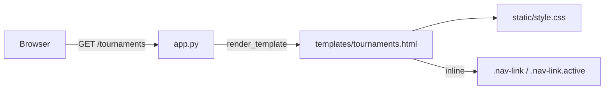

# Briefing: batch-canonical-t01-t2 — 2026-04-20

## Architecture Overview

This is a frontend-only change. The relevant layer is a single Jinja2 template — no Python, no database, no JS.



## Key Files

| Path | Purpose |
|------|---------|
| `templates/tournaments.html` | Tournaments page — the **only** file to change |
| `static/style.css` | Global stylesheet — **do not touch** |
| `templates/scoreboard.html` | Scoreboard page — **do not touch** |

## Conventions

- All page-scoped CSS lives in an inline `<style>` block inside the template's `<head>`. This project does **not** use external per-page CSS files.
- Nav links use the class `nav-link` (defined both in `static/style.css` globally and overridden locally in each template's inline `<style>` block).
- Site accent colour: `#4ade80` (green). Hover/lighter tint: `#86efac`. Background: `#1a1a2e`. Dark surface: `#0f172a`.
- `Courier New` monospace throughout; letter-spacing 2px on nav items.

## Gotchas

- `static/style.css` already defines `a.nav-link` with `color: #4ade80` and hover `#86efac`. The inline `<style>` in `tournaments.html` also re-declares `a.nav-link`. Add `.active` to that **inline** block only — do not touch the global CSS.
- The subtitle bar is a `<p class="subtitle">` element. The two links inside it are plain `<a>` tags. Only the Scoreboard link needs the active class — the "← Back to Game" link must remain unchanged.
- Do not add an active state to any other page's nav (scoreboard.html, history.html, etc.) — scope is tournaments only.

---

## Task 126: Tournaments Nav Active State

### Goal
The "Scoreboard" nav link on `/tournaments` should appear visually active (bold + accent underline), distinguishing the current page from the back-navigation link.

### Files to Modify

| File | Change |
|------|--------|
| `templates/tournaments.html` | 1. Add `active` to the Scoreboard `<a>` class. 2. Add `.nav-link.active` CSS rule to the inline `<style>` block. |

### Files to Read
- `templates/tournaments.html` (source of truth for current markup and inline CSS)
- `static/style.css` (reference only — do not modify)

### Do Not Touch
- `static/style.css`
- `static/game.js`
- `app.py`
- `templates/scoreboard.html`
- Any other template

### Current Markup (verbatim, from `templates/tournaments.html` line ~85)

```html
<p class="subtitle"><a href="/" class="nav-link">← Back to Game</a> &nbsp;|&nbsp; <a href="/scoreboard" class="nav-link">Scoreboard</a></p>
```

### Target Markup

```html
<p class="subtitle"><a href="/" class="nav-link">← Back to Game</a> &nbsp;|&nbsp; <a href="/scoreboard" class="nav-link active">Scoreboard</a></p>
```

### CSS Rule to Add (inside the inline `<style>` block in `<head>`)

```css
a.nav-link.active {
    color: #86efac;
    font-weight: bold;
    border-bottom: 2px solid #4ade80;
    padding-bottom: 1px;
}
```

Place it immediately after the existing `a.nav-link:hover` rule in the inline `<style>` block.

### Acceptance Check

Visit `http://localhost:5000/tournaments` — the "Scoreboard" link in the subtitle bar should appear bolder and/or underlined/accented compared to the "← Back to Game" link. The "← Back to Game" link must look identical to its current state.
