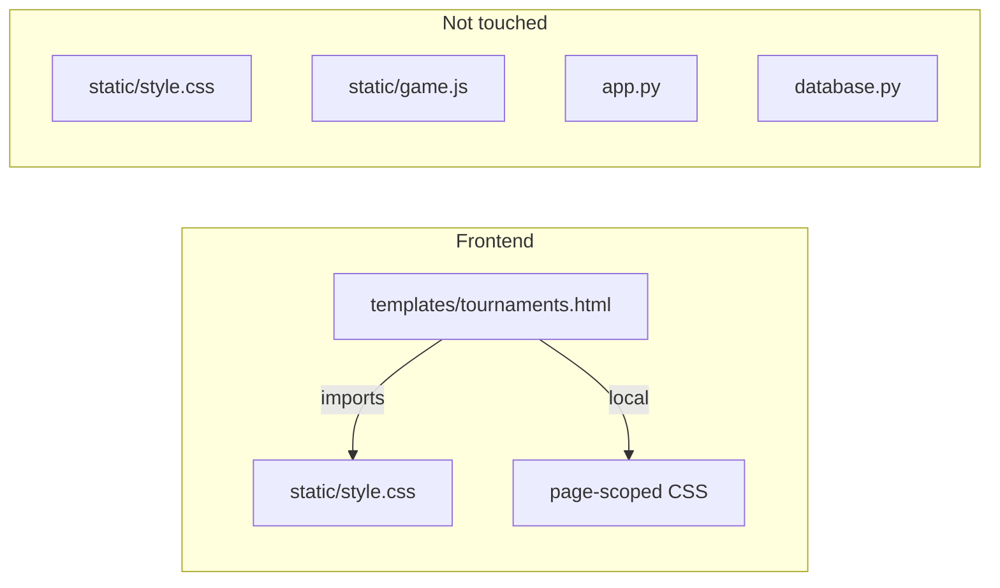

# Briefing: batch-canonical-t01-t3
**Date:** 2026-04-20
**Project:** game-test (Snake)
**Tasks:** 1 (T-127)

---

## Architecture Overview

This batch is **frontend-only**. No backend, no JS, no database.



The tournaments page has its own `<style>` block inside `<head>`. The shared `style.css` defines the `.nav-link` and `.nav-link:hover` rules used across all pages. The fix lives entirely in the page-scoped `<style>` block — do **not** touch the shared stylesheet.

---

## Key Files

| Path | Purpose |
|------|---------|
| `projects/game-test/templates/tournaments.html` | Tournaments page — the only file to modify |
| `projects/game-test/static/style.css` | Shared styles — **read only, do not modify** |

---

## Conventions

1. **Design tokens** — The project uses a small, fixed colour palette. Do not invent new values.
   - Primary green: `#4ade80`
   - Hover/lighter green: `#86efac`
   - Body text: `#e0e0e0`
   - Muted: `#6b7280`
   - Background: `#1a1a2e` / `#0f172a`

2. **Nav link pattern** — Defined in `static/style.css`:
   ```css
   a.nav-link {
       color: #4ade80;
       text-decoration: none;
       font-size: 0.8rem;
       letter-spacing: 2px;
       text-transform: uppercase;
   }
   a.nav-link:hover {
       color: #86efac;
   }
   ```
   `tournaments.html` also re-declares these rules verbatim inside its own `<style>` block (lines ~88–95). The active state class must be added after them.

3. **Class naming** — Use BEM-style modifier: `.nav-link--active`. Apply alongside `.nav-link`, not instead of it.

4. **No build step** — Vanilla HTML/CSS. Changes are live immediately when the file is saved.

---

## Gotchas

- `tournaments.html` declares `.nav-link` / `.nav-link:hover` **locally** inside `<style>`, in addition to the shared stylesheet. The active style must be added to the local block — not to `style.css`.
- The subtitle `<p>` contains two links separated by ` &nbsp;|&nbsp; `. Only the **"Scoreboard"** link gets the active class. Leave "← Back to Game" unchanged.
- `scoreboard.html` has its own nav too (only "← Back to Game"). This task does **not** touch that page.

---

## Task 127: Tournaments Nav Active State

### Goal
When a user is on `/tournaments`, the "Scoreboard" link in the page subtitle nav should be visually highlighted to communicate it is the current/active page.

### Files to modify
- `projects/game-test/templates/tournaments.html`

### Files to read
- `projects/game-test/static/style.css` (understand existing `.nav-link` definition — read only)

### Do NOT touch
- `static/style.css`
- `static/game.js`
- `app.py`
- `database.py`
- `templates/scoreboard.html`
- Any other template

### Current state — key snippet

The subtitle nav in `tournaments.html` (currently around line 91):
```html
<p class="subtitle"><a href="/" class="nav-link">← Back to Game</a> &nbsp;|&nbsp; <a href="/scoreboard" class="nav-link">Scoreboard</a></p>
```

The local `<style>` block already contains (around lines 88–95):
```css
a.nav-link {
    color: #4ade80;
    text-decoration: none;
    font-size: 0.8rem;
    letter-spacing: 2px;
    text-transform: uppercase;
}

a.nav-link:hover {
    color: #86efac;
}
```

### Required changes

**1. Add `.nav-link--active` rule** inside the existing local `<style>` block, after the `.nav-link:hover` rule:
```css
a.nav-link--active {
    font-weight: bold;
    text-decoration: underline;
    color: #86efac;
}
```
(Use this combination or any subset — bold alone, underline alone, or colour shift alone are all acceptable. The key requirement is visual differentiation that fits the existing palette.)

**2. Apply the class** to the "Scoreboard" anchor:
```html
<a href="/scoreboard" class="nav-link nav-link--active">Scoreboard</a>
```

### Acceptance check

Navigate to `http://localhost:5000/tournaments` in a browser. The "Scoreboard" link must be visually distinct from the "← Back to Game" link (bolder, underlined, or lighter green). The "← Back to Game" link must be unchanged. No console errors. No changes to any other page.
