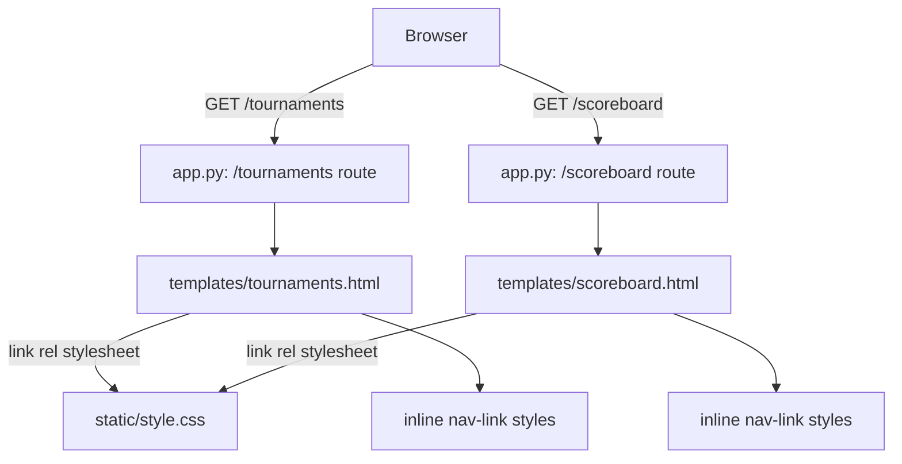

# Project Brief — batch-canonical-t01

**Batch:** batch-canonical-t01  
**Group:** group-canonical-t01  
**Generated:** 2026-04-20  
**Scope:** Frontend-only — nav active state on tournaments page

---

## Architecture Overview



The app has no shared base template / Jinja2 inheritance. Each template is standalone. Nav styles (`.nav-link`, `.nav-link:hover`) are duplicated in `<style>` blocks per-template, not in `style.css`.

---

## Key Files

| File | Purpose |
|------|---------|
| `templates/tournaments.html` | Tournaments page — contains the nav subtitle with the Scoreboard link to be styled |
| `templates/scoreboard.html` | Scoreboard page — has its own `<style>` block with `.nav-link` definition |
| `static/style.css` | Global styles — does NOT currently define `.nav-link` (defined per-template inline) |
| `app.py` | Flask routes — read-only for this task |

---

## Conventions

- Color palette: `#4ade80` (green accent), `#86efac` (lighter hover green), `#6b7280` (muted gray), `#1a1a2e` (page bg)
- Font: `'Courier New', monospace` throughout
- Nav links use `text-transform: uppercase; letter-spacing: 2px; font-size: 0.8rem`
- No build step — changes to `.html` and `.css` are live immediately
- `.nav-link` and `.nav-link:hover` are defined as `<style>` blocks inside each template that needs them (not in `style.css`)

---

## Gotchas

- **`.nav-link` is NOT in `style.css`** — it lives in the `<style>` block of `tournaments.html` (lines 111–123). Adding it to `style.css` alone won't work unless the template also references the global sheet AND the local block is adjusted.
- The simplest approach: add a `.nav-link-active` rule to the **same `<style>` block** in `tournaments.html`, and add the class to the Scoreboard `<a>` tag. No `style.css` changes required.
- `scoreboard.html` currently only has `← Back to Game` in its subtitle — there is no cross-link back to tournaments, so no active-state treatment needed there for this task.

---

## Dependencies

- Changing `tournaments.html` only affects the tournaments page. No other templates link to it.
- `style.css` is shared — if `.nav-link-active` is added there, it will be available on ALL pages, but only tournaments.html sets the class, so no side-effects.

---

## Client Preferences

- Visual treatment should be consistent with the existing accent scheme (`#4ade80`/`#86efac`)
- No JavaScript required — pure CSS class on the anchor

---

## Task 124: Tournaments Nav Active State

**Files to modify:**
- `templates/tournaments.html` — add `nav-link-active` class to Scoreboard `<a>` tag; add `.nav-link-active` rule to existing `<style>` block
- `static/style.css` — optional if adding globally, but per-template `<style>` block is preferred

**Files to read (not modify):**
- `templates/scoreboard.html` — understand existing nav pattern; no change needed
- `static/style.css` — understand global styles

**Do not touch:** `app.py`, `database.py`, `static/game.js`, any template other than `tournaments.html`

**Key snippet** (tournaments.html line 126):
```html
<p class="subtitle"><a href="/" class="nav-link">← Back to Game</a> &nbsp;|&nbsp; <a href="/scoreboard" class="nav-link">Scoreboard</a></p>
```
Change to:
```html
<p class="subtitle"><a href="/" class="nav-link">← Back to Game</a> &nbsp;|&nbsp; <a href="/scoreboard" class="nav-link nav-link-active">Scoreboard</a></p>
```

**CSS to add** (inside the existing `<style>` block in tournaments.html, after line 119):
```css
a.nav-link-active {
    font-weight: bold;
    text-decoration: underline;
    color: #86efac;
}
```

**Acceptance check:** On `/tournaments`, the "Scoreboard" nav link is visually distinct from "← Back to Game" (bold + underline, or accent-colour change). The "← Back to Game" link is not affected. No other pages are affected.

---

## Task 125: Tournaments Nav: highlight Scoreboard link as active

Identical scope to Task 124 — same file, same change. This is a duplicate created in the same batch.

**Files to modify:**
- `templates/tournaments.html` — add `nav-link-active` class to Scoreboard `<a>` tag (line 126); add `.nav-link-active` CSS rule to `<style>` block
- `static/style.css` — add `.nav-link-active` rule if a shared approach is preferred

**Files to read (not modify):**
- `templates/scoreboard.html` — existing nav-link pattern reference
- `static/style.css` — existing global styles

**Do not touch:** `app.py`, `database.py`, `static/game.js`, any template other than `tournaments.html`

**Key snippet** (tournaments.html line 126):
```html
<p class="subtitle"><a href="/" class="nav-link">← Back to Game</a> &nbsp;|&nbsp; <a href="/scoreboard" class="nav-link">Scoreboard</a></p>
```

**CSS to add** (in `<style>` block at tournaments.html ~line 119, or in `static/style.css`):
```css
a.nav-link-active {
    font-weight: bold;
    text-decoration: underline;
    color: #86efac;
}
```

**Acceptance check:** `.nav-link-active` class is applied to the Scoreboard `<a>` in `tournaments.html`, a matching CSS rule exists (in-template or global), and the link is visually distinct when visiting `/tournaments`.
