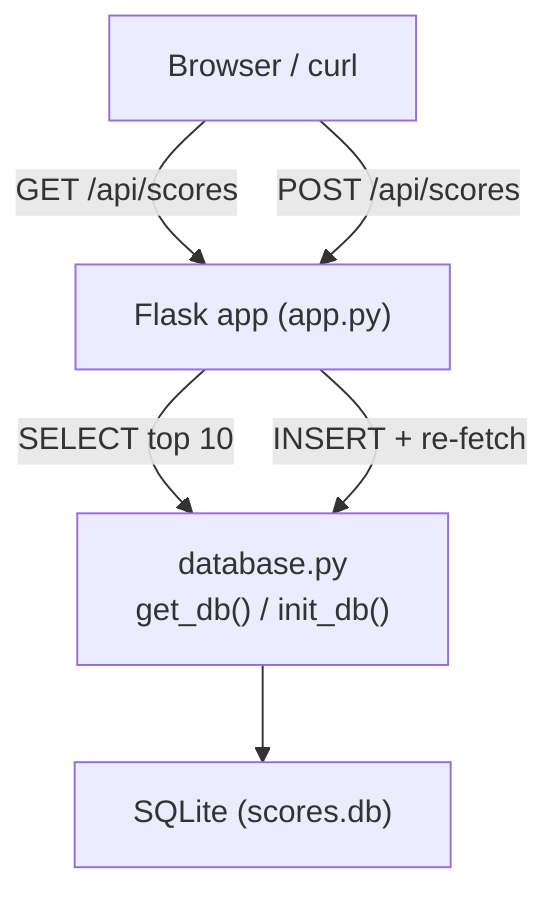
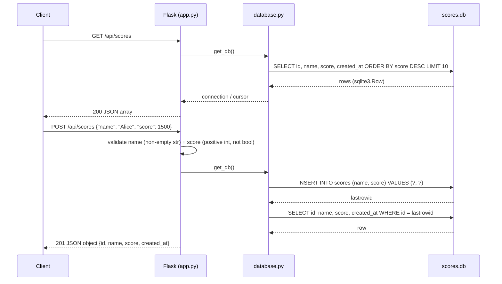

# Project Brief — batch-20260407-01
## Leaderboard API Endpoints

---

## Architecture Overview





---

## Key Files

| File | Purpose |
|------|---------|
| `app.py` | Flask app — all routes live here. The two stubbed handlers are `get_scores()` and `post_score()` |
| `database.py` | SQLite helpers: `get_db()` returns a connection with `row_factory = sqlite3.Row`; `init_db()` creates the table |
| `requirements.txt` | `flask>=3.0.0` — no other deps |
| `static/game.js` | Frontend Snake game — calls `GET /api/scores` on load and `POST /api/scores` on score submit. **Do not modify.** |
| `templates/index.html` | Main page template. **Do not modify.** |

---

## Conventions

- **Route handlers** are plain functions decorated with `@app.route(...)`. No blueprints.
- **JSON responses** use `jsonify(...)`. Never `return json.dumps(...)` directly.
- **DB access pattern**: use `with database.get_db() as conn:` for auto-commit/rollback context.
- **Row serialisation**: `conn.row_factory = sqlite3.Row` is already set — convert rows with `dict(row)` or `[dict(r) for r in rows]`.
- **No ORM** — raw SQL only.

---

## Gotchas

### 1. `bool` is a subclass of `int` in Python
`isinstance(True, int)` returns `True`. You must explicitly reject booleans before accepting a score as an integer:
```python
if not isinstance(score, int) or isinstance(score, bool) or score <= 0:
    return jsonify({"error": "score must be a positive integer"}), 422
```

### 2. `request.get_json(silent=True)` vs `request.get_json()`
Use `silent=True` so Flask returns `None` instead of raising a 400 when the body is not valid JSON. Then check for `None` yourself to return a controlled error response.

### 3. Re-fetch after INSERT for `created_at`
SQLite does not return the full row from an INSERT. Use `cursor.lastrowid` to do a second SELECT so the response includes the DB-generated `created_at`:
```python
cursor = conn.execute('INSERT INTO scores (name, score) VALUES (?, ?)', (name, score))
conn.commit()
row = conn.execute('SELECT id, name, score, created_at FROM scores WHERE id = ?', (cursor.lastrowid,)).fetchone()
return jsonify(dict(row)), 201
```

### 4. `conn.row_factory = sqlite3.Row` already set
Do not re-set it. `get_db()` in `database.py` configures it on every connection.

### 5. Whitespace-only names
`name.strip()` before validation and before insert. The check should be:
```python
if not isinstance(name, str) or not name.strip():
```

---

## Dependencies

- `get_scores()` and `post_score()` both depend on `database.get_db()`. No other cross-handler dependencies.
- `database.init_db()` is called at startup (`if __name__ == '__main__'`). The table will exist when handlers run.
- The frontend (`static/game.js`) calls these endpoints — do not change the response shape or the game will break.

---

## Files to Modify

Only `app.py`. Replace the two stubbed handlers. No other files need to change.

---

## Client Preferences / Assumptions

- **`created_at`** returned as raw SQLite string (e.g. `"2026-04-07 14:24:13"`). No ISO-8601 conversion.
- **Error body shape**: `{"error": "message"}` — standard convention.
- Both tasks are in the same group and should be implemented together in one PR.
